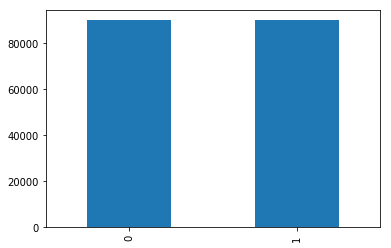
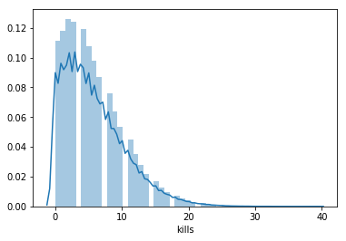
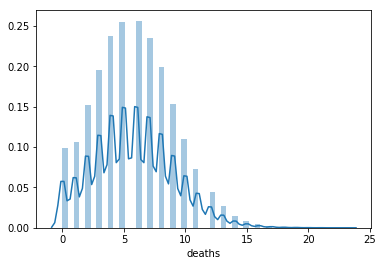
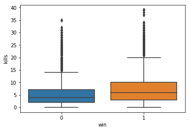
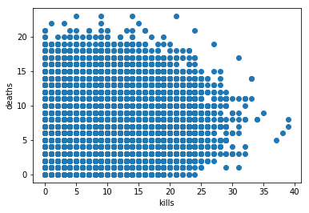

## 赛事介绍
实时对战游戏是人工智能研究领域的一个热点。由于游戏复杂性、部分可观察和动态实时变化战局等游戏特点使得研究变得比较困难。我们可以在选择英雄阶段预测胜负概率，也可以在比赛期间根据比赛实时数据进行建模。那么我们英雄联盟对局进行期间，能知道自己的胜率吗？


## 赛事任务
比赛数据使用了英雄联盟玩家的实时游戏数据，记录下用户在游戏中对局数据（如击杀数、住物理伤害）。希望参赛选手能从数据集中挖掘出数据的规律，并预测玩家在本局游戏中的输赢情况。

赛题训练集案例如下：
- 训练集18万数据；
- 测试集2万条数据；

```plain
import pandas as pd
import numpy as np

train = pd.read_csv('train.csv.zip')
```

对于数据集中每一行为一个玩家的游戏数据，数据字段如下所示：

* id：玩家记录id
* win：是否胜利，标签变量
* kills：击杀次数
* deaths：死亡次数
* assists：助攻次数
* largestkillingspree：最大 killing spree（游戏术语，意味大杀特杀。当你连续杀死三个对方英雄而中途没有死亡时）
* largestmultikill：最大mult ikill（游戏术语，短时间内多重击杀）
* longesttimespentliving：最长存活时间
* doublekills：doublekills次数
* triplekills：doublekills次数
* quadrakills：quadrakills次数
* pentakills：pentakills次数
* totdmgdealt：总伤害
* magicdmgdealt：魔法伤害
* physicaldmgdealt：物理伤害
* truedmgdealt：真实伤害
* largestcrit：最大暴击伤害
* totdmgtochamp：对对方玩家的伤害
* magicdmgtochamp：对对方玩家的魔法伤害
* physdmgtochamp：对对方玩家的物理伤害
* truedmgtochamp：对对方玩家的真实伤害
* totheal：治疗量
* totunitshealed：痊愈的总单位
* dmgtoturrets：对炮塔的伤害
* timecc：法控时间
* totdmgtaken：承受的伤害
* magicdmgtaken：承受的魔法伤害
* physdmgtaken：承受的物理伤害
* truedmgtaken：承受的真实伤害
* wardsplaced：侦查守卫放置次数
* wardskilled：侦查守卫摧毁次数
* firstblood：是否为firstblood

测试集中label字段win为空，需要选手预测。

##  评审规则

1. 数据说明

选手需要提交测试集队伍排名预测，具体的提交格式如下：

```plain
win
0
1
1
0
```

 2. 评估指标

本次竞赛的使用准确率进行评分，数值越高精度越高，评估代码参考：

```
from sklearn.metrics import accuracy_score
y_pred = [0, 2, 1, 3]
y_true = [0, 1, 2, 3]
accuracy_score(y_true, y_pred)
```

## Baseline使用指导
1、点击‘fork按钮’，出现‘fork项目’弹窗         
2、点击‘创建按钮’ ，出现‘运行项目’弹窗    
3、点击‘运行项目’，自动跳转至新页面      
4、点击‘启动环境’ ，出现‘选择运行环境’弹窗     
5、选择运行环境（启动项目需要时间，请耐心等待），出现‘环境启动成功’弹窗，点击确定        
6、点击进入环境，即可进入notebook环境      
7、鼠标移至下方每个代码块内（代码块左侧边框会变成浅蓝色），再依次点击每个代码块左上角的‘三角形运行按钮’，待一个模块运行完以后再运行下一个模块，直至全部运行完成  
  
  
8、下载页面左侧submission.zip压缩包  
  
9、在比赛页提交submission.zip压缩包，等待系统评测结束后，即可登榜！    
  
10、点击页面左侧‘版本-生成新版本’  
  
11、填写‘版本名称’，点击‘生成版本按钮’，即可在个人主页查看到该项目（可选择公开此项目哦）  


```python
import pandas as pd
import paddle
import numpy as np
%pylab inline
import seaborn as sns

# 读取train和test的文件，返回的dataframe的数据结构
train_df = pd.read_csv('data/data137276/train.csv.zip')
test_df = pd.read_csv('data/data137276/test.csv.zip')

# 删除列id和timecc（法控时间）以及五杀
train_df = train_df.drop(['id','timecc','pentakills'], axis=1)
test_df = test_df.drop(['id','timecc','pentakills'], axis=1)
# train_df = train_df.drop(['id','timecc','pentakills','magicdmgtochamp','physdmgtochamp','truedmgtochamp','magicdmgtaken','physdmgtaken','truedmgtaken'], axis=1)
# test_df = test_df.drop(['id','timecc','pentakills','magicdmgtochamp','physdmgtochamp','truedmgtochamp','magicdmgtaken','physdmgtaken','truedmgtaken'], axis=1)
```

    Populating the interactive namespace from numpy and matplotlib


## 数据分析


```python
# 计算每列数据的缺失率
train_df.isnull().mean(0)
```


    win                       0.0
    kills                     0.0
    deaths                    0.0
    assists                   0.0
    largestkillingspree       0.0
    largestmultikill          0.0
    longesttimespentliving    0.0
    doublekills               0.0
    triplekills               0.0
    quadrakills               0.0
    totdmgdealt               0.0
    magicdmgdealt             0.0
    physicaldmgdealt          0.0
    truedmgdealt              0.0
    largestcrit               0.0
    totdmgtochamp             0.0
    magicdmgtochamp           0.0
    physdmgtochamp            0.0
    truedmgtochamp            0.0
    totheal                   0.0
    totunitshealed            0.0
    dmgtoturrets              0.0
    totdmgtaken               0.0
    magicdmgtaken             0.0
    physdmgtaken              0.0
    truedmgtaken              0.0
    wardsplaced               0.0
    wardskilled               0.0
    firstblood                0.0
    dtype: float64


```python
# 查看win列的数据，以条形统计图形式展现
train_df['win'].value_counts().plot(kind='bar')
```


    <matplotlib.axes._subplots.AxesSubplot at 0x7f293d6b9ed0>





```python
# 展示条形图和核密度统计图
sns.distplot(train_df['kills'])
```


    <matplotlib.axes._subplots.AxesSubplot at 0x7f295209e910>





```python
# 展示死亡率
sns.distplot(train_df['deaths'])
```

    /opt/conda/envs/python35-paddle120-env/lib/python3.7/site-packages/seaborn/distributions.py:179: DeprecationWarning: `np.float` is a deprecated alias for the builtin `float`. To silence this warning, use `float` by itself. Doing this will not modify any behavior and is safe. If you specifically wanted the numpy scalar type, use `np.float64` here.
    Deprecated in NumPy 1.20; for more details and guidance: https://numpy.org/devdocs/release/1.20.0-notes.html#deprecations
      a = np.asarray(a, np.float)


    <matplotlib.axes._subplots.AxesSubplot at 0x7f293c41fc10>





```python
# 箱型图
# 箱型图链接：https://blog.csdn.net/Artoria_QZH/article/details/102790740?spm=1001.2101.3001.6650.1&utm_medium=distribute.pc_relevant.none-task-blog-2%7Edefault%7ECTRLIST%7Edefault-1-102790740-blog-115874925.pc_relevant_multi_platform_whitelistv1&depth_1-utm_source=distribute.pc_relevant.none-task-blog-2%7Edefault%7ECTRLIST%7Edefault-1-102790740-blog-115874925.pc_relevant_multi_platform_whitelistv1&utm_relevant_index=2
sns.boxplot(y='kills', x='win', data=train_df)
# 箱型图结论：win的时候kills更多
```

    /opt/conda/envs/python35-paddle120-env/lib/python3.7/site-packages/seaborn/categorical.py:340: DeprecationWarning: `np.float` is a deprecated alias for the builtin `float`. To silence this warning, use `float` by itself. Doing this will not modify any behavior and is safe. If you specifically wanted the numpy scalar type, use `np.float64` here.
    Deprecated in NumPy 1.20; for more details and guidance: https://numpy.org/devdocs/release/1.20.0-notes.html#deprecations
      np.asarray(s, dtype=np.float)
    /opt/conda/envs/python35-paddle120-env/lib/python3.7/site-packages/seaborn/utils.py:538: DeprecationWarning: `np.float` is a deprecated alias for the builtin `float`. To silence this warning, use `float` by itself. Doing this will not modify any behavior and is safe. If you specifically wanted the numpy scalar type, use `np.float64` here.
    Deprecated in NumPy 1.20; for more details and guidance: https://numpy.org/devdocs/release/1.20.0-notes.html#deprecations
      np.asarray(values).astype(np.float)


    <matplotlib.axes._subplots.AxesSubplot at 0x7f29629b4c10>





```python
# 散点图
# kill与death的对应关系
plt.scatter(train_df['kills'], train_df['deaths'])
plt.xlabel('kills')
plt.ylabel('deaths')
```


    Text(0,0.5,'deaths')





```python
# 视野得分
def wardsgrade(df):
    df['wardsgrade']=0
    for i in range(len(df)):
        # 获取wardsplaced和wardskilled值
        wardsplaced = df['wardsplaced'][i]
        wardskilled = df['wardskilled'][i]
        df['wardsgrade']= wardsplaced + wardskilled
        print(f'{i}')
wardsgrade(train_df)
wardsgrade(test_df)
```

    19999


```python
def kda(df):
    df['kda']=0.0
    for i in range(len(df)):
        # 获取K、D、A的值
        kill = df['kills'][i]
        death = df['deaths'][i]
        assists = df['assists'][i]
        if death != 0:
            kda = (kill+assists)/death
        else:
            kda = kill+assists
        df['kda'][i]=kda
        print(f'{i}:{kill}/{death}/{assists}/{kda}')
    return df

kda(train_df)
kda(test_df)
```

    0:1/5/2/0.6
    1:5/8/7/1.5
    2:1/6/16/2.8333333333333335
    3:1/2/0/0.5
    4:4/11/25/2.6363636363636362
    5:8/6/10/3.0
    6:4/12/9/1.0833333333333333
    7:4/7/8/1.7142857142857142
    8:3/6/11/2.3333333333333335
    9:11/1/5/16.0
    10:11/6/12/3.8333333333333335
    11:4/5/6/2.0
    12:8/6/11/3.1666666666666665
    13:5/7/3/1.1428571428571428
    14:4/20/21/1.25
    15:7/3/6/4.333333333333333
    16:0/7/2/0.2857142857142857
    17:10/10/12/2.2
    18:2/6/18/3.3333333333333335
    19:0/6/7/1.1666666666666667
    20:3/8/6/1.125
    21:7/3/5/4.0
    22:4/2/7/5.5
    23:12/3/7/6.333333333333333
    24:0/6/11/1.8333333333333333
    25:6/3/4/3.3333333333333335
    26:4/11/5/0.8181818181818182
    27:5/8/3/1.0
    28:12/9/8/2.2222222222222223
    29:1/5/2/0.6
    30:1/3/4/1.6666666666666667
    31:6/7/2/1.1428571428571428
    32:3/4/3/1.5
    33:0/3/13/4.333333333333333
    34:12/4/10/5.5
    35:10/7/8/2.5714285714285716
    36:0/4/8/2.0
    37:0/3/3/1.0
    38:13/9/10/2.5555555555555554
    39:4/8/2/0.75
    40:10/2/8/9.0
    41:5/14/22/1.9285714285714286
    42:6/2/7/6.5
    43:0/0/0/0
    44:4/9/6/1.1111111111111112
    45:11/17/18/1.7058823529411764
    46:4/6/3/1.1666666666666667
    47:9/3/5/4.666666666666667
    48:7/3/19/8.666666666666666
    49:6/7/8/2.0
    50:14/9/8/2.4444444444444446
    51:6/6/8/2.3333333333333335
    52:5/9/2/0.7777777777777778
    53:9/4/10/4.75
    54:11/9/8/2.111111111111111
    55:0/0/0/0
    56:7/8/5/1.5
    57:13/4/8/5.25
    58:0/12/10/0.8333333333333334
    59:3/2/15/9.0
    60:9/12/16/2.0833333333333335
    61:1/6/4/0.8333333333333334
    62:11/6/9/3.3333333333333335
    63:4/4/4/2.0
    64:4/6/0/0.6666666666666666
    65:0/1/0/0.0
    66:4/13/7/0.8461538461538461
    67:3/6/2/0.8333333333333334
    68:1/9/7/0.8888888888888888
    69:3/2/11/7.0
    70:4/3/7/3.6666666666666665
    71:1/2/3/2.0
    72:3/9/6/1.0
    73:9/6/4/2.1666666666666665
    74:5/7/1/0.8571428571428571
    75:13/7/12/3.5714285714285716
    76:1/4/19/5.0
    77:3/2/7/5.0
    78:1/9/0/0.1111111111111111
    79:5/0/3/8
    80:11/2/7/9.0
    81:5/9/2/0.7777777777777778
    82:13/2/9/11.0
    83:6/7/8/2.0
    84:11/1/4/15.0
    85:0/0/0/0
    86:8/9/4/1.3333333333333333
    87:0/1/2/2.0
    88:10/4/8/4.5
    89:4/5/7/2.2
    90:2/9/12/1.5555555555555556
    91:3/7/15/2.5714285714285716
    92:17/9/10/3.0
    93:5/9/6/1.2222222222222223
    94:12/4/5/4.25
    95:12/7/12/3.4285714285714284
    96:6/8/7/1.625
    97:2/9/2/0.4444444444444444
    98:6/5/17/4.6
    99:0/0/0/0
    100:10/8/10/2.5
    101:5/7/15/2.857142857142857
    102:5/3/18/7.666666666666667
    103:3/5/4/1.4
    104:1/8/5/0.75
    105:11/10/6/1.7
    106:5/10/14/1.9
    107:9/12/8/1.4166666666666667
    108:7/10/20/2.7
    109:0/0/0/0
    110:4/6/22/4.333333333333333
    111:3/8/6/1.125
    112:7/5/10/3.4
    113:4/13/12/1.2307692307692308
    114:3/9/15/2.0
    115:4/3/11/5.0
    116:9/7/6/2.142857142857143
    117:6/4/15/5.25
    118:5/1/16/21.0
    119:0/3/2/0.6666666666666666
    120:1/8/4/0.625
    121:10/7/11/3.0
    122:3/3/2/1.6666666666666667
    123:1/10/3/0.4
    124:4/5/15/3.8
    125:1/10/9/1.0
    126:13/2/7/10.0
    127:12/6/4/2.6666666666666665
    128:1/3/2/1.0
    129:1/6/5/1.0
    130:7/8/7/1.75
    131:12/1/8/20.0
    132:11/6/3/2.3333333333333335
    133:7/8/6/1.625
    134:5/8/7/1.5
    135:0/0/0/0
    136:2/8/2/0.5
    137:3/6/12/2.5
    138:5/8/6/1.375
    139:4/5/16/4.0
    140:2/9/4/0.6666666666666666
    141:13/11/8/1.9090909090909092
    142:2/0/9/11
    143:7/4/9/4.0
    144:5/7/16/3.0
    145:2/5/8/2.0
    146:5/12/14/1.5833333333333333
    147:8/3/2/3.3333333333333335
    148:3/6/7/1.6666666666666667
    149:1/7/6/1.0
    150:7/2/12/9.5
    151:6/3/6/4.0
    152:1/5/4/1.0
    153:19/12/9/2.3333333333333335
    154:4/4/10/3.5
    155:1/5/19/4.0
    156:3/10/5/0.8
    157:2/7/0/0.2857142857142857
    158:10/4/11/5.25
    159:10/2/10/10.0
    160:10/6/8/3.0
    161:1/10/9/1.0
    162:2/3/10/4.0
    163:5/1/13/18.0
    164:10/8/8/2.25
    165:8/7/12/2.857142857142857
    166:11/3/6/5.666666666666667
    167:5/9/12/1.8888888888888888
    168:12/6/6/3.0
    169:8/7/3/1.5714285714285714
    170:3/6/5/1.3333333333333333
    171:0/0/0/0
    172:6/7/6/1.7142857142857142
    173:2/3/7/3.0
    174:3/5/15/3.6
    175:6/16/13/1.1875
    176:8/11/8/1.4545454545454546
    177:7/8/8/1.875
    178:3/4/22/6.25
    179:0/4/0/0.0
    180:5/5/18/4.6
    181:2/8/4/0.75
    182:7/4/17/6.0
    183:2/3/15/5.666666666666667
    184:9/9/8/1.8888888888888888
    185:7/2/8/7.5
    186:0/10/6/0.6
    187:3/3/10/4.333333333333333
    188:7/4/2/2.25
    189:6/4/6/3.0
    190:2/2/11/6.5
    191:4/3/4/2.6666666666666665
    192:4/6/10/2.3333333333333335
    193:1/4/3/1.0
    194:2/3/14/5.333333333333333
    195:8/7/4/1.7142857142857142
    196:12/4/5/4.25
    197:0/0/0/0
    198:12/8/7/2.375
    199:3/4/1/1.0
    200:2/7/2/0.5714285714285714
    201:6/5/10/3.2
    202:3/3/29/10.666666666666666
    203:3/6/12/2.5
    204:10/2/4/7.0
    205:6/11/1/0.6363636363636364
    206:24/7/12/5.142857142857143
    207:8/11/4/1.0909090909090908
    208:8/9/7/1.6666666666666667
    209:3/7/18/3.0
    210:3/2/0/1.5
    211:14/6/12/4.333333333333333
    212:16/4/4/5.0
    213:9/8/11/2.5
    214:11/7/11/3.142857142857143
    215:12/9/11/2.5555555555555554
    216:16/4/5/5.25
    217:3/6/10/2.1666666666666665
    218:4/5/10/2.8
    219:12/15/8/1.3333333333333333
    220:1/1/17/18.0
    221:3/9/7/1.1111111111111112
    222:2/2/5/3.5
    223:1/4/15/4.0
    224:19/1/12/31.0
    225:2/8/0/0.25
    226:11/7/11/3.142857142857143
    227:1/1/17/18.0
    228:14/8/7/2.625
    229:5/6/6/1.8333333333333333
    230:16/1/8/24.0
    231:6/4/10/4.0
    232:4/3/4/2.6666666666666665
    233:6/7/3/1.2857142857142858
    234:7/7/10/2.4285714285714284
    235:5/6/3/1.3333333333333333
    236:0/0/0/0
    237:2/8/4/0.75
    238:5/14/4/0.6428571428571429
    239:1/8/9/1.25
    240:6/8/11/2.125
    241:3/6/16/3.1666666666666665
    242:1/8/11/1.5
    243:3/2/15/9.0
    244:6/2/13/9.5
    245:7/0/4/11
    246:4/12/6/0.8333333333333334
    247:3/12/8/0.9166666666666666
    248:1/2/0/0.5
    249:5/9/9/1.5555555555555556
    250:5/10/16/2.1
    251:2/6/12/2.3333333333333335
    252:8/7/12/2.857142857142857
    253:1/8/12/1.625
    254:4/1/14/18.0
    255:11/1/4/15.0
    256:6/1/1/7.0
    257:12/0/8/20
    258:6/6/3/1.5
    259:10/4/15/6.25
    260:6/8/6/1.5
    261:5/1/5/10.0
    262:8/8/10/2.25
    263:5/4/4/2.25
    264:9/0/0/9
    265:4/7/6/1.4285714285714286
    266:10/7/5/2.142857142857143
    267:15/7/5/2.857142857142857
    268:8/0/5/13
    269:11/3/20/10.333333333333334
    270:9/11/11/1.8181818181818181
    271:7/6/27/5.666666666666667
    272:7/3/7/4.666666666666667
    273:7/5/11/3.6
    274:8/3/6/4.666666666666667
    275:0/5/23/4.6
    276:10/14/8/1.2857142857142858
    277:4/3/23/9.0
    278:3/5/1/0.8
    279:0/0/0/0
    280:4/4/6/2.5
    281:8/9/10/2.0
    282:6/5/1/1.4
    283:4/2/8/6.0
    284:2/0/22/24
    285:1/3/16/5.666666666666667
    286:0/7/0/0.0
    287:17/5/11/5.6
    288:0/4/0/0.0
    289:3/8/19/2.75
    290:8/10/9/1.7
    291:7/9/10/1.8888888888888888
    292:3/7/2/0.7142857142857143
    293:6/8/5/1.375
    294:8/12/6/1.1666666666666667
    295:1/5/2/0.6
    296:12/11/9/1.9090909090909092
    297:3/6/28/5.166666666666667
    298:2/4/3/1.25
    299:28/15/24/3.466666666666667
    300:13/5/10/4.6
    301:7/9/8/1.6666666666666667
    302:2/5/13/3.0
    303:2/7/12/2.0
    304:6/7/7/1.8571428571428572
    305:2/8/0/0.25
    306:2/3/20/7.333333333333333
    307:9/14/4/0.9285714285714286
    308:7/4/3/2.5
    309:0/3/0/0.0
    310:10/6/5/2.5
    311:7/1/7/14.0
    312:6/6/10/2.6666666666666665
    313:15/3/8/7.666666666666667
    314:3/4/3/1.5
    315:2/8/9/1.375
    316:3/10/11/1.4
    317:2/7/25/3.857142857142857
    318:4/3/7/3.6666666666666665
    319:7/10/5/1.2
    320:1/3/27/9.333333333333334
    321:12/5/14/5.2
    322:8/9/9/1.8888888888888888
    323:6/7/6/1.7142857142857142
    324:6/10/8/1.4
    325:23/8/10/4.125
    326:0/2/7/3.5
    327:12/9/8/2.2222222222222223
    328:0/2/1/0.5
    329:8/2/11/9.5
    330:5/4/4/2.25
    331:0/11/7/0.6363636363636364
    332:5/4/3/2.0
    333:7/9/9/1.7777777777777777
    334:3/4/17/5.0
    335:5/6/11/2.6666666666666665
    336:9/8/7/2.0
    337:10/6/12/3.6666666666666665
    338:0/2/19/9.5
    339:2/8/1/0.375
    340:4/2/7/5.5
    341:0/7/8/1.1428571428571428
    342:1/0/0/1
    343:2/8/6/1.0
    344:11/4/12/5.75
    345:11/3/22/11.0
    346:11/9/4/1.6666666666666667
    347:6/6/12/3.0
    348:13/3/9/7.333333333333333
    349:6/7/2/1.1428571428571428
    350:7/8/6/1.625
    351:0/9/22/2.4444444444444446
    352:12/10/3/1.5
    353:5/11/12/1.5454545454545454
    354:3/5/16/3.8
    355:0/0/0/0
    356:0/10/9/0.9
    357:2/10/3/0.5
    358:6/12/14/1.6666666666666667
    359:6/2/1/3.5
    360:3/7/18/3.0
    361:0/5/0/0.0
    362:5/9/9/1.5555555555555556
    363:10/5/13/4.6
    364:3/9/8/1.2222222222222223
    365:13/13/11/1.8461538461538463
    366:11/5/26/7.4
    367:2/10/3/0.5
    368:12/6/8/3.3333333333333335
    369:2/2/11/6.5
    370:7/4/10/4.25
    371:3/1/1/4.0
    372:9/15/11/1.3333333333333333
    373:11/10/4/1.5
    374:5/9/7/1.3333333333333333
    375:14/8/7/2.625
    376:7/8/5/1.5
    377:4/6/10/2.3333333333333335
    378:5/5/0/1.0
    379:1/5/5/1.2
    380:13/11/9/2.0
    381:9/1/6/15.0
    382:1/6/13/2.3333333333333335
    383:0/0/0/0
    384:4/7/11/2.142857142857143
    385:4/1/9/13.0
    386:9/4/14/5.75
    387:4/4/5/2.25
    388:3/1/11/14.0
    389:14/6/18/5.333333333333333
    390:17/15/14/2.066666666666667
    391:3/4/9/3.0
    392:4/6/7/1.8333333333333333
    393:4/8/0/0.5
    394:12/6/11/3.8333333333333335
    395:2/5/1/0.6
    396:10/11/10/1.8181818181818181
    397:3/15/14/1.1333333333333333
    398:8/3/7/5.0
    399:3/7/3/0.8571428571428571
    400:2/8/5/0.875
    401:9/4/9/4.5
    402:2/3/3/1.6666666666666667
    403:1/3/17/6.0
    404:0/5/12/2.4
    405:0/0/0/0
    406:5/7/0/0.7142857142857143
    407:0/5/9/1.8
    408:3/7/4/1.0
    409:1/2/2/1.5
    410:14/12/19/2.75
    411:1/7/5/0.8571428571428571
    412:14/16/4/1.125
    413:16/10/5/2.1
    414:2/1/8/10.0
    415:1/7/3/0.5714285714285714
    416:1/6/12/2.1666666666666665
    417:7/15/14/1.4
    418:0/6/7/1.1666666666666667
    419:2/1/8/10.0
    420:11/10/13/2.4
    421:14/3/10/8.0
    422:4/10/5/0.9
    423:6/13/6/0.9230769230769231
    424:0/6/3/0.5
    425:7/8/5/1.5
    426:2/9/15/1.8888888888888888
    427:3/7/12/2.142857142857143
    428:6/1/5/11.0
    429:9/8/9/2.25
    430:16/13/21/2.8461538461538463
    431:24/10/19/4.3
    432:2/16/13/0.9375
    433:8/10/11/1.9
    434:7/5/10/3.4
    435:7/9/7/1.5555555555555556
    436:8/10/2/1.0
    437:0/2/6/3.0
    438:2/7/2/0.5714285714285714
    439:4/6/3/1.1666666666666667
    440:5/9/4/1.0
    441:11/4/13/6.0
    442:4/5/25/5.8
    443:8/6/2/1.6666666666666667
    444:3/6/8/1.8333333333333333
    445:7/4/4/2.75
    446:5/6/4/1.5
    447:6/1/10/16.0
    448:16/9/15/3.4444444444444446
    449:18/6/7/4.166666666666667
    450:3/5/19/4.4
    451:8/7/8/2.2857142857142856
    452:0/0/0/0
    453:5/5/5/2.0
    454:5/4/13/4.5
    455:4/11/23/2.4545454545454546
    456:8/9/2/1.1111111111111112
    457:9/8/6/1.875
    458:1/4/14/3.75
    459:3/5/3/1.2
    460:5/11/7/1.0909090909090908
    461:11/6/9/3.3333333333333335
    462:9/6/14/3.8333333333333335
    463:4/4/2/1.5
    464:11/5/11/4.4
    465:6/7/5/1.5714285714285714
    466:8/2/9/8.5
    467:18/6/6/4.0
    468:1/5/3/0.8
    469:14/4/6/5.0
    470:14/8/5/2.375
    471:1/9/5/0.6666666666666666
    472:8/3/5/4.333333333333333
    473:8/6/6/2.3333333333333335
    474:0/5/27/5.4
    475:4/8/7/1.375
    476:6/3/7/4.333333333333333
    477:10/5/3/2.6
    478:6/11/14/1.8181818181818181
    479:11/9/20/3.4444444444444446
    480:8/14/8/1.1428571428571428
    481:7/13/8/1.1538461538461537
    482:1/5/15/3.2
    483:10/2/10/10.0
    484:3/9/13/1.7777777777777777
    485:9/7/7/2.2857142857142856
    486:6/4/14/5.0
    487:15/8/12/3.375
    488:1/8/3/0.5
    489:3/1/5/8.0
    490:5/5/7/2.4
    491:1/4/8/2.25
    492:5/6/5/1.6666666666666667
    493:8/3/11/6.333333333333333
    494:2/7/15/2.4285714285714284
    495:10/1/3/13.0
    496:4/12/13/1.4166666666666667
    497:14/3/10/8.0
    498:4/6/4/1.3333333333333333
    499:14/1/1/15.0
    500:5/11/10/1.3636363636363635
    501:15/10/10/2.5
    502:14/7/13/3.857142857142857
    503:1/3/1/0.6666666666666666
    504:7/7/18/3.5714285714285716
    505:1/4/1/0.5
    506:5/9/11/1.7777777777777777
    507:15/7/17/4.571428571428571
    508:11/6/9/3.3333333333333335
    509:11/9/12/2.5555555555555554
    510:1/11/8/0.8181818181818182
    511:1/8/14/1.875
    512:5/7/10/2.142857142857143
    513:5/3/7/4.0
    514:11/12/7/1.5
    515:1/3/1/0.6666666666666666
    516:14/7/4/2.5714285714285716
    517:4/3/6/3.3333333333333335
    518:20/8/6/3.25
    519:0/0/1/1
    520:3/4/3/1.5
    521:3/6/29/5.333333333333333
    522:13/10/9/2.2
    523:7/6/9/2.6666666666666665
    524:9/4/12/5.25
    525:6/8/22/3.5
    526:5/5/0/1.0
    527:0/4/5/1.25
    528:13/7/5/2.5714285714285716
    529:10/7/3/1.8571428571428572
    530:19/10/13/3.2
    531:17/13/4/1.6153846153846154
    532:10/6/8/3.0
    533:12/8/6/2.25
    534:13/3/14/9.0
    535:4/3/13/5.666666666666667
    536:7/3/9/5.333333333333333
    537:4/1/8/12.0
    538:3/3/4/2.3333333333333335
    539:1/4/19/5.0
    540:17/4/3/5.0
    541:5/5/1/1.2
    542:3/7/8/1.5714285714285714
    543:2/4/3/1.25
    544:5/3/5/3.3333333333333335
    545:4/4/10/3.5
    546:16/8/21/4.625
    547:8/1/6/14.0
    548:0/7/1/0.14285714285714285
    549:0/0/0/0
    550:1/7/5/0.8571428571428571
    551:3/1/13/16.0
    552:0/6/4/0.6666666666666666
    553:9/2/5/7.0
    554:2/8/5/0.875
    555:1/8/4/0.625
    556:4/9/13/1.8888888888888888
    557:8/1/17/25.0
    558:2/5/6/1.6
    559:0/5/22/4.4
    560:14/10/6/2.0
    561:9/15/14/1.5333333333333334
    562:8/4/8/4.0
    563:10/8/5/1.875
    564:0/4/9/2.25
    565:3/7/4/1.0
    566:2/6/17/3.1666666666666665
    567:1/11/8/0.8181818181818182


    /opt/conda/envs/python35-paddle120-env/lib/python3.7/site-packages/ipykernel_launcher.py:12: SettingWithCopyWarning: 
    A value is trying to be set on a copy of a slice from a DataFrame
    
    See the caveats in the documentation: https://pandas.pydata.org/pandas-docs/stable/user_guide/indexing.html#returning-a-view-versus-a-copy
      if sys.path[0] == '':


    568:16/5/5/4.2
    569:9/11/6/1.3636363636363635
    570:21/3/15/12.0
    571:1/7/4/0.7142857142857143
    572:10/3/6/5.333333333333333
    573:9/2/5/7.0
    574:5/6/7/2.0
    575:2/12/6/0.6666666666666666
    576:7/3/15/7.333333333333333
    577:0/0/0/0
    578:1/2/6/3.5
    579:1/7/23/3.4285714285714284
    580:4/1/9/13.0
    581:8/12/31/3.25
    582:2/10/10/1.2
    583:1/5/16/3.4
    584:1/8/15/2.0
    585:6/1/10/16.0
    586:0/3/8/2.6666666666666665
    587:3/12/9/1.0
    588:5/10/14/1.9
    589:2/8/2/0.5
    590:25/13/26/3.923076923076923
    591:6/2/0/3.0
    592:4/8/10/1.75
    593:6/6/5/1.8333333333333333
    594:0/1/1/1.0
    595:9/0/11/20
    596:12/7/10/3.142857142857143
    597:1/4/4/1.25
    598:8/4/7/3.75
    599:8/3/10/6.0
    600:5/0/7/12
    601:3/6/18/3.5
    602:8/3/15/7.666666666666667
    603:7/9/11/2.0
    604:0/2/13/6.5
    605:0/10/6/0.6
    606:3/7/3/0.8571428571428571
    607:0/5/1/0.2
    608:3/5/13/3.2
    609:4/3/23/9.0
    610:9/15/14/1.5333333333333334
    611:12/9/28/4.444444444444445
    612:3/2/12/7.5
    613:8/0/1/9
    614:4/8/4/1.0
    615:4/9/2/0.6666666666666666
    616:6/5/3/1.8
    617:0/0/0/0
    618:2/5/11/2.6
    619:2/9/18/2.2222222222222223
    620:13/1/10/23.0
    621:8/1/8/16.0
    622:12/3/3/5.0
    623:10/5/10/4.0
    624:11/3/10/7.0
    625:5/2/4/4.5
    626:4/9/6/1.1111111111111112
    627:2/5/1/0.6
    628:5/7/6/1.5714285714285714
    629:4/6/8/2.0
    630:4/11/13/1.5454545454545454
    631:2/4/8/2.5
    632:9/7/15/3.4285714285714284
    633:0/0/0/0
    634:5/5/12/3.4
    635:4/7/24/4.0
    636:6/2/10/8.0
    637:11/3/4/5.0
    638:4/4/15/4.75
    639:7/6/11/3.0
    640:7/4/13/5.0
    641:22/5/9/6.2
    642:2/6/12/2.3333333333333335
    643:4/1/23/27.0
    644:11/11/23/3.090909090909091
    645:0/3/2/0.6666666666666666
    646:8/6/14/3.6666666666666665
    647:1/5/5/1.2
    648:4/7/6/1.4285714285714286
    649:2/5/0/0.4
    650:0/7/12/1.7142857142857142
    651:9/9/7/1.7777777777777777
    652:2/2/22/12.0
    653:1/6/4/0.8333333333333334
    654:9/7/9/2.5714285714285716
    655:1/3/6/2.3333333333333335
    656:0/0/0/0
    657:3/6/13/2.6666666666666665
    658:2/8/21/2.875
    659:5/14/12/1.2142857142857142
    660:6/12/5/0.9166666666666666
    661:1/7/15/2.2857142857142856
    662:11/6/3/2.3333333333333335
    663:10/3/4/4.666666666666667
    664:6/3/10/5.333333333333333
    665:12/2/9/10.5
    666:0/5/2/0.4
    667:6/10/10/1.6
    668:3/4/10/3.25
    669:10/3/6/5.333333333333333
    670:0/0/0/0
    671:3/5/4/1.4
    672:1/4/14/3.75
    673:6/4/13/4.75
    674:4/3/0/1.3333333333333333
    675:3/7/2/0.7142857142857143
    676:12/7/10/3.142857142857143
    677:5/1/7/12.0
    678:2/4/9/2.75
    679:3/8/8/1.375
    680:12/4/13/6.25
    681:3/3/4/2.3333333333333335
    682:1/5/2/0.6
    683:9/3/11/6.666666666666667
    684:3/6/16/3.1666666666666665
    685:3/11/4/0.6363636363636364
    686:9/11/7/1.4545454545454546
    687:7/8/10/2.125
    688:5/7/16/3.0
    689:1/5/6/1.4
    690:10/9/2/1.3333333333333333
    691:8/4/6/3.5
    692:5/8/11/2.0
    693:3/5/12/3.0
    694:2/4/5/1.75
    695:7/1/4/11.0
    696:9/3/9/6.0
    697:8/1/6/14.0
    698:1/1/19/20.0
    699:4/9/10/1.5555555555555556
    700:0/13/35/2.6923076923076925
    701:6/8/3/1.125
    702:10/5/3/2.6
    703:0/7/2/0.2857142857142857
    704:6/0/7/13
    705:0/4/9/2.25
    706:9/5/12/4.2
    707:13/11/4/1.5454545454545454
    708:7/3/4/3.6666666666666665
    709:3/11/12/1.3636363636363635
    710:5/5/4/1.8
    711:3/2/7/5.0
    712:3/5/6/1.8
    713:12/9/13/2.7777777777777777
    714:6/7/6/1.7142857142857142
    715:5/5/16/4.2
    716:8/9/3/1.2222222222222223
    717:11/5/10/4.2
    718:12/8/12/3.0
    719:3/4/20/5.75
    720:4/5/7/2.2
    721:3/5/0/0.6
    722:0/3/1/0.3333333333333333
    723:6/12/6/1.0
    724:9/8/11/2.5
    725:7/14/18/1.7857142857142858
    726:4/4/5/2.25
    727:14/6/7/3.5
    728:6/3/12/6.0
    729:12/7/6/2.5714285714285716
    730:3/3/17/6.666666666666667
    731:4/10/10/1.4
    732:8/4/3/2.75
    733:3/9/7/1.1111111111111112
    734:10/6/14/4.0
    735:4/6/5/1.5
    736:0/0/0/0
    737:7/7/3/1.4285714285714286
    738:7/6/26/5.5
    739:7/3/8/5.0
    740:0/9/0/0.0
    741:5/9/6/1.2222222222222223
    742:8/5/14/4.4
    743:1/7/7/1.1428571428571428
    744:7/1/12/19.0
    745:15/8/24/4.875
    746:1/2/20/10.5
    747:9/4/12/5.25
    748:2/3/16/6.0
    749:0/1/3/3.0
    750:5/2/9/7.0
    751:6/5/10/3.2
    752:4/10/8/1.2
    753:3/3/7/3.3333333333333335
    754:3/5/3/1.2
    755:2/6/1/0.5
    756:6/2/1/3.5
    757:1/7/8/1.2857142857142858
    758:5/10/8/1.3
    759:0/0/0/0
    760:8/6/8/2.6666666666666665
    761:9/11/6/1.3636363636363635
    762:6/6/5/1.8333333333333333
    763:5/7/6/1.5714285714285714
    764:7/1/2/9.0
    765:2/4/5/1.75
    766:1/6/6/1.1666666666666667
    767:7/4/7/3.5
    768:2/5/9/2.2
    769:0/3/10/3.3333333333333335
    770:3/5/17/4.0
    771:12/13/11/1.7692307692307692
    772:3/5/2/1.0
    773:1/4/2/0.75
    774:6/8/7/1.625
    775:19/13/7/2.0
    776:0/3/0/0.0
    777:0/5/15/3.0
    778:0/4/16/4.0
    779:5/6/3/1.3333333333333333
    780:1/6/6/1.1666666666666667
    781:4/8/10/1.75
    782:0/1/16/16.0
    783:8/12/17/2.0833333333333335
    784:6/3/6/4.0
    785:6/8/9/1.875
    786:5/6/4/1.5
    787:2/7/7/1.2857142857142858
    788:3/5/1/0.8
    789:3/7/13/2.2857142857142856
    790:9/9/13/2.4444444444444446
    791:5/6/8/2.1666666666666665
    792:6/3/16/7.333333333333333
    793:3/4/3/1.5
    794:9/6/8/2.8333333333333335
    795:11/6/2/2.1666666666666665
    796:4/7/8/1.7142857142857142
    797:3/10/14/1.7
    798:11/6/13/4.0
    799:14/7/9/3.2857142857142856
    800:10/4/6/4.0
    801:4/6/6/1.6666666666666667
    802:4/2/7/5.5
    803:0/3/18/6.0
    804:12/5/17/5.8
    805:2/8/18/2.5
    806:10/4/13/5.75
    807:4/3/14/6.0
    808:5/2/5/5.0
    809:2/9/4/0.6666666666666666
    810:11/4/9/5.0
    811:4/12/9/1.0833333333333333
    812:1/7/18/2.7142857142857144
    813:1/3/2/1.0
    814:11/8/16/3.375
    815:8/1/3/11.0
    816:1/0/0/1
    817:3/2/2/2.5
    818:5/5/7/2.4
    819:4/2/6/5.0
    820:0/5/20/4.0
    821:2/2/3/2.5
    822:8/9/8/1.7777777777777777
    823:1/6/8/1.5
    824:1/5/15/3.2
    825:0/6/8/1.3333333333333333
    826:0/7/2/0.2857142857142857
    827:0/0/0/0
    828:13/5/11/4.8
    829:5/10/8/1.3
    830:6/4/14/5.0
    831:3/8/11/1.75
    832:4/6/5/1.5
    833:8/4/10/4.5
    834:2/7/4/0.8571428571428571
    835:19/6/6/4.166666666666667
    836:3/10/18/2.1
    837:16/12/8/2.0
    838:10/0/9/19
    839:2/7/10/1.7142857142857142
    840:12/6/12/4.0
    841:0/7/1/0.14285714285714285
    842:0/8/4/0.5
    843:6/2/1/3.5
    844:7/5/20/5.4
    845:8/3/9/5.666666666666667
    846:0/0/0/0
    847:8/6/6/2.3333333333333335
    848:5/8/7/1.5
    849:9/4/12/5.25
    850:2/7/8/1.4285714285714286
    851:5/13/1/0.46153846153846156
    852:5/7/19/3.4285714285714284
    853:10/0/5/15
    854:3/5/13/3.2
    855:7/7/19/3.7142857142857144
    856:2/3/8/3.3333333333333335
    857:4/10/16/2.0
    858:3/3/10/4.333333333333333
    859:14/4/8/5.5
    860:2/7/3/0.7142857142857143
    861:1/9/1/0.2222222222222222
    862:5/8/2/0.875
    863:3/8/1/0.5
    864:3/7/37/5.714285714285714
    865:1/2/17/9.0
    866:8/5/4/2.4
    867:5/5/3/1.6
    868:10/10/8/1.8
    869:1/8/12/1.625
    870:2/8/9/1.375
    871:3/7/3/0.8571428571428571
    872:10/5/5/3.0
    873:5/6/6/1.8333333333333333
    874:11/2/9/10.0
    875:9/8/7/2.0
    876:4/2/8/6.0
    877:0/8/6/0.75
    878:5/8/10/1.875
    879:0/4/5/1.25
    880:5/7/17/3.142857142857143
    881:4/5/10/2.8
    882:9/8/5/1.75
    883:1/6/20/3.5
    884:5/9/18/2.5555555555555554
    885:4/3/6/3.3333333333333335
    886:3/9/7/1.1111111111111112
    887:3/2/1/2.0
    888:1/3/2/1.0
    889:11/5/27/7.6
    890:2/0/4/6
    891:17/5/15/6.4
    892:4/4/14/4.5
    893:3/4/4/1.75
    894:6/6/3/1.5
    895:2/2/1/1.5
    896:4/7/8/1.7142857142857142
    897:0/8/19/2.375
    898:3/9/1/0.4444444444444444
    899:9/2/5/7.0
    900:0/1/5/5.0
    901:10/8/12/2.75
    902:6/5/6/2.4
    903:2/5/4/1.2
    904:9/10/7/1.6
    905:9/10/16/2.5
    906:4/4/18/5.5
    907:9/8/19/3.5
    908:10/9/9/2.111111111111111
    909:6/5/1/1.4
    910:6/10/7/1.3
    911:10/8/4/1.75
    912:3/10/4/0.7
    913:22/6/15/6.166666666666667
    914:7/9/10/1.8888888888888888
    915:5/9/17/2.4444444444444446
    916:0/5/7/1.4
    917:11/7/5/2.2857142857142856
    918:1/1/11/12.0
    919:5/1/3/8.0
    920:7/5/1/1.6
    921:6/7/7/1.8571428571428572
    922:5/2/8/6.5
    923:1/6/11/2.0
    924:4/10/5/0.9
    925:9/8/7/2.0
    926:2/11/23/2.272727272727273
    927:6/7/8/2.0
    928:0/7/6/0.8571428571428571
    929:6/8/7/1.625
    930:0/5/1/0.2
    931:3/9/4/0.7777777777777778
    932:3/4/7/2.5
    933:16/6/15/5.166666666666667
    934:5/7/8/1.8571428571428572
    935:1/5/8/1.8
    936:7/9/16/2.5555555555555554
    937:9/3/8/5.666666666666667
    938:6/5/13/3.8
    939:4/2/1/2.5
    940:8/4/12/5.0
    941:5/6/6/1.8333333333333333
    942:0/5/3/0.6
    943:3/3/2/1.6666666666666667
    944:5/5/20/5.0
    945:6/4/2/2.0
    946:10/5/10/4.0
    947:4/6/6/1.6666666666666667
    948:6/8/9/1.875
    949:0/7/3/0.42857142857142855
    950:8/0/8/16
    951:3/1/0/3.0
    952:9/15/4/0.8666666666666667
    953:3/15/14/1.1333333333333333
    954:5/4/4/2.25
    955:8/4/9/4.25
    956:9/4/11/5.0
    957:11/2/13/12.0
    958:9/4/17/6.5
    959:4/1/3/7.0
    960:5/2/4/4.5
    961:2/1/13/15.0
    962:11/0/10/21
    963:11/5/20/6.2
    964:6/11/3/0.8181818181818182
    965:23/3/11/11.333333333333334
    966:1/3/18/6.333333333333333
    967:7/8/4/1.375
    968:6/3/10/5.333333333333333
    969:8/12/10/1.5
    970:11/6/8/3.1666666666666665
    971:8/4/3/2.75
    972:7/16/9/1.0
    973:1/8/21/2.75
    974:11/10/12/2.3
    975:2/9/2/0.4444444444444444
    976:3/9/19/2.4444444444444446
    977:7/5/12/3.8
    978:17/12/15/2.6666666666666665
    979:7/7/5/1.7142857142857142
    980:17/6/15/5.333333333333333
    981:5/5/11/3.2
    982:3/4/3/1.5
    983:5/7/5/1.4285714285714286
    984:3/12/18/1.75
    985:2/5/4/1.2
    986:0/7/1/0.14285714285714285
    987:18/3/9/9.0
    988:1/6/2/0.5
    989:5/3/8/4.333333333333333
    990:1/4/10/2.75
    991:11/7/4/2.142857142857143
    992:8/4/11/4.75
    993:7/9/6/1.4444444444444444
    994:4/6/3/1.1666666666666667
    995:6/11/12/1.6363636363636365
    996:14/7/13/3.857142857142857
    997:10/7/18/4.0
    998:2/2/12/7.0
    999:1/6/3/0.6666666666666666
    1000:0/4/12/3.0
    1001:6/9/11/1.8888888888888888
    1002:12/6/8/3.3333333333333335
    1003:11/6/9/3.3333333333333335
    1004:10/2/4/7.0
    1005:4/6/17/3.5
    1006:3/1/5/8.0
    1007:5/10/6/1.1
    1008:1/5/3/0.8
    1009:2/6/6/1.3333333333333333
    1010:3/5/6/1.8
    1011:6/5/1/1.4
    1012:1/4/3/1.0
    1013:4/8/3/0.875
    1014:6/8/4/1.25
    1015:4/5/5/1.8
    1016:2/9/3/0.5555555555555556
    1017:7/3/3/3.3333333333333335
    1018:0/6/16/2.6666666666666665
    1019:8/7/16/3.4285714285714284
    1020:1/5/23/4.8
    1021:4/9/4/0.8888888888888888
    1022:3/1/6/9.0
    1023:13/10/14/2.7
    1024:7/5/6/2.6
    1025:8/10/2/1.0
    1026:3/6/4/1.1666666666666667
    1027:1/3/10/3.6666666666666665
    1028:9/3/14/7.666666666666667
    1029:3/6/4/1.1666666666666667
    1030:7/7/12/2.7142857142857144
    1031:3/1/13/16.0
    1032:3/4/6/2.25
    1033:5/9/2/0.7777777777777778
    1034:3/4/6/2.25
    1035:1/0/14/15
    1036:9/3/7/5.333333333333333
    1037:3/7/3/0.8571428571428571
    1038:8/6/13/3.5
    1039:7/4/15/5.5
    1040:5/3/6/3.6666666666666665
    1041:1/3/28/9.666666666666666
    1042:5/4/6/2.75
    1043:1/4/12/3.25
    1044:12/6/11/3.8333333333333335
    1045:4/5/6/2.0
    1046:18/6/9/4.5
    1047:12/12/20/2.6666666666666665
    1048:3/6/6/1.5
    1049:8/6/11/3.1666666666666665
    1050:5/2/20/12.5
    1051:5/6/3/1.3333333333333333
    1052:6/2/6/6.0
    1053:12/6/7/3.1666666666666665
    1054:2/12/6/0.6666666666666666
    1055:3/1/10/13.0
    1056:0/3/15/5.0
    1057:6/2/7/6.5
    1058:5/8/2/0.875
    1059:3/5/5/1.6
    1060:8/6/1/1.5
    1061:9/8/4/1.625
    1062:1/8/2/0.375
    1063:3/2/3/3.0
    1064:8/11/5/1.1818181818181819
    1065:0/7/12/1.7142857142857142
    1066:12/5/5/3.4
    1067:5/7/2/1.0
    1068:10/3/9/6.333333333333333
    1069:0/5/1/0.2
    1070:10/4/1/2.75
    1071:0/0/0/0
    1072:12/2/13/12.5
    1073:8/1/0/8.0
    1074:8/9/12/2.2222222222222223
    1075:0/4/3/0.75
    1076:2/7/17/2.7142857142857144
    1077:10/8/9/2.375
    1078:2/8/0/0.25
    1079:1/5/5/1.2
    1080:1/1/5/6.0
    1081:1/5/8/1.8
    1082:4/8/14/2.25
    1083:7/8/7/1.75
    1084:3/5/4/1.4
    1085:3/7/18/3.0
    1086:0/7/3/0.42857142857142855
    1087:8/2/3/5.5
    1088:3/7/13/2.2857142857142856
    1089:12/9/14/2.888888888888889
    1090:4/4/6/2.5
    1091:0/1/14/14.0
    1092:0/0/0/0
    1093:3/5/3/1.2
    1094:8/1/11/19.0
    1095:8/3/3/3.6666666666666665
    1096:4/2/3/3.5
    1097:11/7/6/2.4285714285714284
    1098:7/6/6/2.1666666666666665
    1099:3/3/2/1.6666666666666667
    1100:2/3/15/5.666666666666667
    1101:9/16/14/1.4375
    1102:0/0/0/0
    1103:0/0/0/0
    1104:5/10/6/1.1
    1105:7/4/4/2.75
    1106:8/10/8/1.6
    1107:1/6/9/1.6666666666666667
    1108:0/6/6/1.0
    1109:4/8/6/1.25
    1110:7/0/8/15
    1111:6/7/11/2.4285714285714284
    1112:6/2/3/4.5
    1113:4/7/10/2.0
    1114:16/6/15/5.166666666666667
    1115:6/8/4/1.25
    1116:6/2/7/6.5
    1117:1/10/4/0.5
    1118:3/6/4/1.1666666666666667
    1119:10/9/9/2.111111111111111
    1120:3/10/8/1.1
    1121:14/8/7/2.625
    1122:5/6/27/5.333333333333333
    1123:9/6/2/1.8333333333333333
    1124:2/7/2/0.5714285714285714
    1125:8/4/12/5.0
    1126:15/6/10/4.166666666666667
    1127:2/2/6/4.0
    1128:1/6/2/0.5
    1129:6/10/10/1.6
    1130:4/5/3/1.4
    1131:2/4/10/3.0
    1132:1/10/5/0.6
    1133:15/7/6/3.0
    1134:6/7/1/1.0
    1135:0/0/0/0
    1136:7/2/11/9.0
    1137:10/7/4/2.0
    1138:8/6/9/2.8333333333333335
    1139:6/1/18/24.0
    1140:10/5/11/4.2
    1141:0/11/0/0.0
    1142:5/2/10/7.5
    1143:19/9/5/2.6666666666666665
    1144:10/8/11/2.625
    1145:2/1/5/7.0
    1146:1/3/7/2.6666666666666665
    1147:13/7/6/2.7142857142857144
    19999:6/1/27/33.0


<div>
<style scoped>
    .dataframe tbody tr th:only-of-type {
        vertical-align: middle;
    }

    .dataframe tbody tr th {
        vertical-align: top;
    }

    .dataframe thead th {
        text-align: right;
    }
</style>
<table border="1" class="dataframe">
  <thead>
    <tr style="text-align: right;">
      <th></th>
      <th>kills</th>
      <th>deaths</th>
      <th>assists</th>
      <th>largestkillingspree</th>
      <th>largestmultikill</th>
      <th>longesttimespentliving</th>
      <th>doublekills</th>
      <th>triplekills</th>
      <th>quadrakills</th>
      <th>totdmgdealt</th>
      <th>...</th>
      <th>dmgtoturrets</th>
      <th>totdmgtaken</th>
      <th>magicdmgtaken</th>
      <th>physdmgtaken</th>
      <th>truedmgtaken</th>
      <th>wardsplaced</th>
      <th>wardskilled</th>
      <th>firstblood</th>
      <th>wardsgrade</th>
      <th>kda</th>
    </tr>
  </thead>
  <tbody>
    <tr>
      <th>0</th>
      <td>8</td>
      <td>7</td>
      <td>5</td>
      <td>2</td>
      <td>1</td>
      <td>874</td>
      <td>0</td>
      <td>0</td>
      <td>0</td>
      <td>143764</td>
      <td>...</td>
      <td>0</td>
      <td>20112</td>
      <td>6704</td>
      <td>12945</td>
      <td>462</td>
      <td>10</td>
      <td>3</td>
      <td>0</td>
      <td>65</td>
      <td>1.857143</td>
    </tr>
    <tr>
      <th>1</th>
      <td>4</td>
      <td>8</td>
      <td>5</td>
      <td>2</td>
      <td>1</td>
      <td>978</td>
      <td>0</td>
      <td>0</td>
      <td>0</td>
      <td>208763</td>
      <td>...</td>
      <td>4974</td>
      <td>49389</td>
      <td>19109</td>
      <td>29651</td>
      <td>629</td>
      <td>15</td>
      <td>2</td>
      <td>0</td>
      <td>65</td>
      <td>1.125000</td>
    </tr>
    <tr>
      <th>2</th>
      <td>19</td>
      <td>6</td>
      <td>8</td>
      <td>10</td>
      <td>2</td>
      <td>912</td>
      <td>5</td>
      <td>0</td>
      <td>0</td>
      <td>192145</td>
      <td>...</td>
      <td>5653</td>
      <td>26606</td>
      <td>8344</td>
      <td>17627</td>
      <td>634</td>
      <td>14</td>
      <td>2</td>
      <td>0</td>
      <td>65</td>
      <td>4.500000</td>
    </tr>
    <tr>
      <th>3</th>
      <td>1</td>
      <td>8</td>
      <td>6</td>
      <td>0</td>
      <td>1</td>
      <td>519</td>
      <td>0</td>
      <td>0</td>
      <td>0</td>
      <td>137372</td>
      <td>...</td>
      <td>3988</td>
      <td>25852</td>
      <td>5111</td>
      <td>19552</td>
      <td>1189</td>
      <td>5</td>
      <td>3</td>
      <td>0</td>
      <td>65</td>
      <td>0.875000</td>
    </tr>
    <tr>
      <th>4</th>
      <td>1</td>
      <td>10</td>
      <td>12</td>
      <td>0</td>
      <td>1</td>
      <td>646</td>
      <td>0</td>
      <td>0</td>
      <td>0</td>
      <td>50707</td>
      <td>...</td>
      <td>465</td>
      <td>34486</td>
      <td>16690</td>
      <td>16882</td>
      <td>914</td>
      <td>39</td>
      <td>9</td>
      <td>0</td>
      <td>65</td>
      <td>1.300000</td>
    </tr>
    <tr>
      <th>...</th>
      <td>...</td>
      <td>...</td>
      <td>...</td>
      <td>...</td>
      <td>...</td>
      <td>...</td>
      <td>...</td>
      <td>...</td>
      <td>...</td>
      <td>...</td>
      <td>...</td>
      <td>...</td>
      <td>...</td>
      <td>...</td>
      <td>...</td>
      <td>...</td>
      <td>...</td>
      <td>...</td>
      <td>...</td>
      <td>...</td>
      <td>...</td>
    </tr>
    <tr>
      <th>19995</th>
      <td>2</td>
      <td>9</td>
      <td>28</td>
      <td>0</td>
      <td>1</td>
      <td>886</td>
      <td>0</td>
      <td>0</td>
      <td>0</td>
      <td>26097</td>
      <td>...</td>
      <td>1081</td>
      <td>34860</td>
      <td>14476</td>
      <td>19691</td>
      <td>692</td>
      <td>22</td>
      <td>1</td>
      <td>0</td>
      <td>65</td>
      <td>3.333333</td>
    </tr>
    <tr>
      <th>19996</th>
      <td>1</td>
      <td>2</td>
      <td>2</td>
      <td>0</td>
      <td>1</td>
      <td>383</td>
      <td>0</td>
      <td>0</td>
      <td>0</td>
      <td>95875</td>
      <td>...</td>
      <td>478</td>
      <td>15828</td>
      <td>1375</td>
      <td>14404</td>
      <td>48</td>
      <td>8</td>
      <td>0</td>
      <td>0</td>
      <td>65</td>
      <td>1.500000</td>
    </tr>
    <tr>
      <th>19997</th>
      <td>2</td>
      <td>9</td>
      <td>4</td>
      <td>0</td>
      <td>1</td>
      <td>387</td>
      <td>0</td>
      <td>0</td>
      <td>0</td>
      <td>86547</td>
      <td>...</td>
      <td>0</td>
      <td>22255</td>
      <td>4189</td>
      <td>16467</td>
      <td>1598</td>
      <td>0</td>
      <td>0</td>
      <td>1</td>
      <td>65</td>
      <td>0.666667</td>
    </tr>
    <tr>
      <th>19998</th>
      <td>0</td>
      <td>5</td>
      <td>0</td>
      <td>0</td>
      <td>0</td>
      <td>381</td>
      <td>0</td>
      <td>0</td>
      <td>0</td>
      <td>47119</td>
      <td>...</td>
      <td>1285</td>
      <td>11519</td>
      <td>4679</td>
      <td>6839</td>
      <td>0</td>
      <td>4</td>
      <td>0</td>
      <td>0</td>
      <td>65</td>
      <td>0.000000</td>
    </tr>
    <tr>
      <th>19999</th>
      <td>6</td>
      <td>1</td>
      <td>27</td>
      <td>4</td>
      <td>2</td>
      <td>1989</td>
      <td>1</td>
      <td>0</td>
      <td>0</td>
      <td>30462</td>
      <td>...</td>
      <td>2153</td>
      <td>17042</td>
      <td>8284</td>
      <td>8640</td>
      <td>117</td>
      <td>50</td>
      <td>15</td>
      <td>0</td>
      <td>65</td>
      <td>33.000000</td>
    </tr>
  </tbody>
</table>
<p>20000 rows × 30 columns</p>
</div>


```python
# 不运行
print(type(train_df['kda'][2]))
```

    <class 'numpy.float64'>


```python
# 不运行
#计算上下四分位数
def count_quartiles(lis):
    q1 = lis[int(1 + (float(len(lis)) - 1) * 1 / 4)]
    q3 = lis[int(1 + (float(len(lis)) - 1) * 3 / 4)]
    return q1, q3

#计算上下边缘
def count_margin(q1, q3):
    q4 = q3 + 1.5 * (q3 - q1)
    q5 = q1 - 1.5 * (q3 - q1)
    return q4, q5
```


```python
# 不运行

# 获取列名
def upper_limit(df):
    columns = df.columns.values.tolist()  #列名
    print(columns)
    upper_limit_values = []
    for column in columns[1:]:
        sort_df = df.sort_values(by=column)
        q1,q3 = count_quartiles(list(sort_df[column]))
        column_upper=count_margin(q1,q3)[0]
        upper_limit_values.append(column_upper)
        print(upper_limit_values)
    print(upper_limit_values)

upper_limit(train_df)


```

    ['win', 'kills', 'deaths', 'assists', 'largestkillingspree', 'largestmultikill', 'longesttimespentliving', 'doublekills', 'triplekills', 'quadrakills', 'totdmgdealt', 'magicdmgdealt', 'physicaldmgdealt', 'truedmgdealt', 'largestcrit', 'totdmgtochamp', 'totheal', 'totunitshealed', 'dmgtoturrets', 'totdmgtaken', 'wardsplaced', 'wardskilled', 'firstblood', 'kda']
    [17.0]
    [17.0, 15.5]
    [17.0, 15.5, 24.0]
    [17.0, 15.5, 24.0, 10.0]
    [17.0, 15.5, 24.0, 10.0, 3.5]
    [17.0, 15.5, 24.0, 10.0, 3.5, 1330.5]
    [17.0, 15.5, 24.0, 10.0, 3.5, 1330.5, 2.5]
    [17.0, 15.5, 24.0, 10.0, 3.5, 1330.5, 2.5, 0.0]
    [17.0, 15.5, 24.0, 10.0, 3.5, 1330.5, 2.5, 0.0, 0.0]
    [17.0, 15.5, 24.0, 10.0, 3.5, 1330.5, 2.5, 0.0, 0.0, 304004.0]
    [17.0, 15.5, 24.0, 10.0, 3.5, 1330.5, 2.5, 0.0, 0.0, 304004.0, 138529.0]
    [17.0, 15.5, 24.0, 10.0, 3.5, 1330.5, 2.5, 0.0, 0.0, 304004.0, 138529.0, 267128.5]
    [17.0, 15.5, 24.0, 10.0, 3.5, 1330.5, 2.5, 0.0, 0.0, 304004.0, 138529.0, 267128.5, 17053.5]
    [17.0, 15.5, 24.0, 10.0, 3.5, 1330.5, 2.5, 0.0, 0.0, 304004.0, 138529.0, 267128.5, 17053.5, 1062.5]
    [17.0, 15.5, 24.0, 10.0, 3.5, 1330.5, 2.5, 0.0, 0.0, 304004.0, 138529.0, 267128.5, 17053.5, 1062.5, 44976.5]
    [17.0, 15.5, 24.0, 10.0, 3.5, 1330.5, 2.5, 0.0, 0.0, 304004.0, 138529.0, 267128.5, 17053.5, 1062.5, 44976.5, 15538.0]
    [17.0, 15.5, 24.0, 10.0, 3.5, 1330.5, 2.5, 0.0, 0.0, 304004.0, 138529.0, 267128.5, 17053.5, 1062.5, 44976.5, 15538.0, 6.0]
    [17.0, 15.5, 24.0, 10.0, 3.5, 1330.5, 2.5, 0.0, 0.0, 304004.0, 138529.0, 267128.5, 17053.5, 1062.5, 44976.5, 15538.0, 6.0, 8037.5]
    [17.0, 15.5, 24.0, 10.0, 3.5, 1330.5, 2.5, 0.0, 0.0, 304004.0, 138529.0, 267128.5, 17053.5, 1062.5, 44976.5, 15538.0, 6.0, 8037.5, 50766.0]
    [17.0, 15.5, 24.0, 10.0, 3.5, 1330.5, 2.5, 0.0, 0.0, 304004.0, 138529.0, 267128.5, 17053.5, 1062.5, 44976.5, 15538.0, 6.0, 8037.5, 50766.0, 24.5]
    [17.0, 15.5, 24.0, 10.0, 3.5, 1330.5, 2.5, 0.0, 0.0, 304004.0, 138529.0, 267128.5, 17053.5, 1062.5, 44976.5, 15538.0, 6.0, 8037.5, 50766.0, 24.5, 7.5]
    [17.0, 15.5, 24.0, 10.0, 3.5, 1330.5, 2.5, 0.0, 0.0, 304004.0, 138529.0, 267128.5, 17053.5, 1062.5, 44976.5, 15538.0, 6.0, 8037.5, 50766.0, 24.5, 7.5, 0.0]
    [17.0, 15.5, 24.0, 10.0, 3.5, 1330.5, 2.5, 0.0, 0.0, 304004.0, 138529.0, 267128.5, 17053.5, 1062.5, 44976.5, 15538.0, 6.0, 8037.5, 50766.0, 24.5, 7.5, 0.0, 8.0]
    [17.0, 15.5, 24.0, 10.0, 3.5, 1330.5, 2.5, 0.0, 0.0, 304004.0, 138529.0, 267128.5, 17053.5, 1062.5, 44976.5, 15538.0, 6.0, 8037.5, 50766.0, 24.5, 7.5, 0.0, 8.0]


```python
# 不运行

sort_df = train_df.sort_values(by="kda")
# print(list(sort_df['kda']))
print(train_df['kda'])
```

    0         0.600000
    1         1.500000
    2         2.833333
    3         0.500000
    4         2.636364
                ...   
    179995    0.000000
    179996    0.000000
    179997    0.000000
    179998    0.000000
    179999    0.000000
    Name: kda, Length: 180000, dtype: float64


```python
# 将每一列的数据全部转化为比例
# 此处可以改进，原因为：除以最大值-未改进

for col in train_df.columns[1:]:
    train_df[col] /= train_df[col].max()
    test_df[col] /= test_df[col].max()
print(train_df)
```

            win     kills    deaths   assists  largestkillingspree  \
    0         0  0.025641  0.217391  0.038462             0.000000   
    1         0  0.128205  0.347826  0.134615             0.096774   
    2         1  0.025641  0.260870  0.307692             0.000000   
    3         0  0.025641  0.086957  0.000000             0.000000   
    4         0  0.102564  0.478261  0.480769             0.000000   
    ...     ...       ...       ...       ...                  ...   
    179995    1  0.025641  0.260870  0.230769             0.000000   
    179996    1  0.179487  0.130435  0.076923             0.161290   
    179997    1  0.230769  0.000000  0.173077             0.290323   
    179998    1  0.358974  0.043478  0.096154             0.322581   
    179999    1  0.102564  0.173913  0.038462             0.064516   
    
            largestmultikill  longesttimespentliving  doublekills  triplekills  \
    0                    0.2                0.187294     0.000000          0.0   
    1                    0.2                0.289664     0.000000          0.0   
    2                    0.2                0.195194     0.000000          0.0   
    3                    0.2                0.125411     0.000000          0.0   
    4                    0.2                0.149770     0.000000          0.0   
    ...                  ...                     ...          ...          ...   
    179995               0.2                0.119157     0.000000          0.0   
    179996               0.2                0.188940     0.000000          0.0   
    179997               0.2                0.000000     0.000000          0.0   
    179998               0.4                0.322581     0.272727          0.0   
    179999               0.2                0.184003     0.000000          0.0   
    
            quadrakills  ...   totheal  totunitshealed  dmgtoturrets  totdmgtaken  \
    0               0.0  ...  0.008824        0.020408      0.000000     0.066190   
    1               0.0  ...  0.006672        0.040816      0.005501     0.208558   
    2               0.0  ...  0.024174        0.030612      0.005973     0.158715   
    3               0.0  ...  0.016161        0.010204      0.000000     0.102717   
    4               0.0  ...  0.068906        0.081633      0.000000     0.236104   
    ...             ...  ...       ...             ...           ...          ...   
    179995          0.0  ...  0.036989        0.030612      0.104406     0.125167   
    179996          0.0  ...  0.026284        0.020408      0.161701     0.093279   
    179997          0.0  ...  0.119458        0.040816      0.120309     0.120875   
    179998          0.0  ...  0.068127        0.010204      0.035274     0.162237   
    179999          0.0  ...  0.006319        0.010204      0.028866     0.093050   
    
            magicdmgtaken  physdmgtaken  truedmgtaken  wardsplaced  wardskilled  \
    0            0.039369      0.071598      0.015951     0.012422     0.020833   
    1            0.101350      0.241007      0.055449     0.031056     0.000000   
    2            0.065994      0.202728      0.010461     0.021739     0.020833   
    3            0.031434      0.141010      0.003023     0.024845     0.020833   
    4            0.254288      0.174233      0.042681     0.105590     0.041667   
    ...               ...           ...           ...          ...          ...   
    179995       0.042912      0.168220      0.004057     0.037267     0.020833   
    179996       0.071092      0.089283      0.021957     0.021739     0.041667   
    179997       0.066175      0.145096      0.000000     0.021739     0.041667   
    179998       0.087089      0.192833      0.009387     0.018634     0.000000   
    179999       0.138839      0.041888      0.009785     0.021739     0.020833   
    
            firstblood  
    0              0.0  
    1              0.0  
    2              0.0  
    3              0.0  
    4              0.0  
    ...            ...  
    179995         0.0  
    179996         0.0  
    179997         1.0  
    179998         0.0  
    179999         0.0  
    
    [180000 rows x 29 columns]


## 搭建模型


```python
# 创建分类器
class Classifier(paddle.nn.Layer):
    # self代表类的实例自身
    def __init__(self):
        # 初始化父类中的一些参数
        super(Classifier, self).__init__()
        
        self.fc1 = paddle.nn.Linear(in_features=28, out_features=40)
        self.fc2 = paddle.nn.Linear(in_features=40, out_features=1)
        self.relu = paddle.nn.ReLU()
    
    # 网络的前向计算
    def forward(self, inputs):
        x = self.relu(self.fc1(inputs))
        x = self.fc2(x)
        return x
```


```python
# 创建模型
model = Classifier()
model.train()
# https://www.paddlepaddle.org.cn/documentation/docs/zh/api/paddle/optimizer/SGD_cn.html#cn-api-paddle-optimizer-sgd
opt = paddle.optimizer.SGD(learning_rate=0.01, parameters=model.parameters())
loss_fn = paddle.nn.BCEWithLogitsLoss()
```


```python
# 不运行
# 测试
# EPOCH_NUM = 100   # 设置外层循环次数
BATCH_SIZE = 100  # 设置batch大小
# 从第0行到倒数1000行（不包括），设置为training.data
# print(train_df)
training_data = train_df.iloc[:-10000,].values.astype(np.float32)
# print(training_data)
# 从倒数1000行到最后一行,设置为val_data
val_data = train_df.iloc[-1000:, ].values.astype(np.float32)
# 将训练数据进行拆分，每个batch包含10条数据
mini_batches = [training_data[k:k+BATCH_SIZE] for k in range(0, len(training_data), BATCH_SIZE)]
i= 1
for iter_id, mini_batch in enumerate(mini_batches):
    x = np.array(mini_batch[:, 1:]) # 获得当前批次训练数据
    y = np.array(mini_batch[:, :1]) # 获得当前批次训练标签
    i=i+1
    if i<10:
        print(y)
        print(1)
```


```python
# train_df = train_df.drop(['wardsplaced','wardskilled'], axis=1)
# test_df = test_df.drop(['wardsplaced','wardskilled'], axis=1)
```


```python
# EPOCH_NUM = 200  # 设置外层循环次数
BATCH_SIZE = 200  # 设置batch大小
# 从第0行到倒数1000行（不包括），设置为training.data
training_data = train_df.iloc[:-20000,].values.astype(np.float32)
# 从倒数1000行到最后一行设置为val_data
val_data = train_df.iloc[-20000:, ].values.astype(np.float32)
epoch_number = 0
max = 0
# 定义外层循环，每一轮循环中
while(True):
    # 在每轮迭代开始之前，将训练数据的顺序随机的打乱
    np.random.shuffle(training_data)
    np.random.shuffle(val_data)
    epoch_number = epoch_number+1
    # 将训练数据进行拆分，每个batch包含10条数据
    mini_batches = [training_data[k:k+BATCH_SIZE] for k in range(0, len(training_data), BATCH_SIZE)]
    
    # 定义内层循环
    for iter_id, mini_batch in enumerate(mini_batches):
         # 获得当前批次训练数据，x是除了win之外的其他数据
        x = np.array(mini_batch[:, 1:])
        y = np.array(mini_batch[:, :1]) # 获得当前批次训练标签，win值
        
        # 将numpy数据转为飞桨动态图tensor的格式
        features = paddle.to_tensor(x)
        y = paddle.to_tensor(y)
        
        # 前向计算
        predicts = model(features)
        
        # 计算损失
        loss = loss_fn(predicts, y, )
        # 计算平均
        avg_loss = paddle.mean(loss)
        if iter_id%200==0:
            acc = (predicts > 0).astype(int).flatten() == y.flatten().astype(int)
            acc = acc.astype(float).mean()

            print("epoch: {}, iter: {}, loss is: {}, acc is {}".format(epoch_number, iter_id, avg_loss.numpy(), acc.numpy()))
        
        # 反向传播，计算每层参数的梯度值
        avg_loss.backward()
        # 更新参数，根据设置好的学习率迭代一步
        opt.step()
        # 清空梯度变量，以备下一轮计算
        opt.clear_grad()
    # 使用验证集
    model.eval()
    test_predict = model(paddle.to_tensor(val_data[:, 1:]))
    test_predict = (test_predict > 0).astype(int).flatten()
    a = pd.DataFrame({'win':
              test_predict.numpy()
             })
    correct = 0
    
    for i in range(len(a)):
        if int(a['win'][i])== int(val_data[:,:1][i][0]):
            correct=correct+1
    correct_percent = correct/len(a)
    if max<correct_percent:
        max = correct_percent
    print("validation percent: ",correct_percent,' max: ',max)
    if correct/len(a)>0.85 and epoch_number>200:
        print("final: ",correct/len(a),' epoch_number: ',epoch_number,' max: ',max)
        break
# 
```

    epoch: 1150, iter: 400, loss is: [0.34293973], acc is [0.865]


    ---------------------------------------------------------------------------

    KeyboardInterrupt                         Traceback (most recent call last)

    /tmp/ipykernel_336/268236396.py in <module>
         27 
         28         # 前向计算
    ---> 29         predicts = model(features)
         30 
         31         # 计算损失


    /opt/conda/envs/python35-paddle120-env/lib/python3.7/site-packages/paddle/fluid/dygraph/layers.py in __call__(self, *inputs, **kwargs)
        915 
        916     def __call__(self, *inputs, **kwargs):
    --> 917         return self._dygraph_call_func(*inputs, **kwargs)
        918 
        919     def forward(self, *inputs, **kwargs):


    /opt/conda/envs/python35-paddle120-env/lib/python3.7/site-packages/paddle/fluid/dygraph/layers.py in _dygraph_call_func(self, *inputs, **kwargs)
        905             self._built = True
        906 
    --> 907         outputs = self.forward(*inputs, **kwargs)
        908 
        909         for forward_post_hook in self._forward_post_hooks.values():


    /tmp/ipykernel_336/377342760.py in forward(self, inputs)
         12     # 网络的前向计算
         13     def forward(self, inputs):
    ---> 14         x = self.relu(self.fc1(inputs))
         15         x = self.fc2(x)
         16         return x


    /opt/conda/envs/python35-paddle120-env/lib/python3.7/site-packages/paddle/fluid/dygraph/layers.py in __call__(self, *inputs, **kwargs)
        915 
        916     def __call__(self, *inputs, **kwargs):
    --> 917         return self._dygraph_call_func(*inputs, **kwargs)
        918 
        919     def forward(self, *inputs, **kwargs):


    /opt/conda/envs/python35-paddle120-env/lib/python3.7/site-packages/paddle/fluid/dygraph/layers.py in _dygraph_call_func(self, *inputs, **kwargs)
        905             self._built = True
        906 
    --> 907         outputs = self.forward(*inputs, **kwargs)
        908 
        909         for forward_post_hook in self._forward_post_hooks.values():


    /opt/conda/envs/python35-paddle120-env/lib/python3.7/site-packages/paddle/nn/layer/common.py in forward(self, input)
        170     def forward(self, input):
        171         out = F.linear(
    --> 172             x=input, weight=self.weight, bias=self.bias, name=self.name)
        173         return out
        174 


    /opt/conda/envs/python35-paddle120-env/lib/python3.7/site-packages/paddle/nn/functional/common.py in linear(x, weight, bias, name)
       1478     if in_dygraph_mode():
       1479         pre_bias = _C_ops.matmul_v2(x, weight, 'trans_x', False, 'trans_y',
    -> 1480                                     False)
       1481 
       1482         if bias is None:


    KeyboardInterrupt: 


```python
# 不运行

print(max)
```

    0.8467


```python
# 不运行

# 使用验证集
model.eval()
val_data = train_df.iloc[-20000:, ].values.astype(np.float32)
test_data = paddle.to_tensor(val_data[:, 1:])
# print(test_data)
test_predict = model(test_data)
test_predict = (test_predict > 0).astype(int).flatten()
print(type(val_data[:,:1][1]))
print(type(test_predict))
a = pd.DataFrame({'win':
              test_predict.numpy()
             })
print(len(a))
print(type(a['win'][1]))
correct = 0
for i in range(len(a)):
    if int(a['win'][i])== int(val_data[:,:1][i][0]):
        correct=correct+1
print(correct/len(a))
```

    <class 'numpy.ndarray'>
    <class 'paddle.Tensor'>
    20000
    <class 'numpy.longlong'>
    0.84545


```python
print(type(test_predict))
a = pd.DataFrame({'win':
              test_predict.numpy()
             })
print(len(a))
print(type(a['win'][1]))
correct = 0
for i in range(len(a)):
    if int(a['win'][i])== int(val_data[:,:1][i][0]):
        correct=correct+1
print(correct/len(a))
```

    <class 'paddle.Tensor'>
    20000
    <class 'numpy.longlong'>
    0.84545


```python
# 原来的代码
model.eval()
test_data = paddle.to_tensor(test_df.values.astype(np.float32))
test_predict = model(test_data)
test_predict = (test_predict > 0).astype(int).flatten()
```


```python
pd.DataFrame({'win':
              test_predict.numpy()
             }).to_csv('submission.csv', index=None)

!zip submission.zip submission.csv
```

    updating: submission.csv (deflated 90%)


## 总结与上分点

1. 原始赛题字段存在关联，可以进一步提取交叉特征。
2. 模型训练过程中可以加入验证集验证过程。


```python

```
